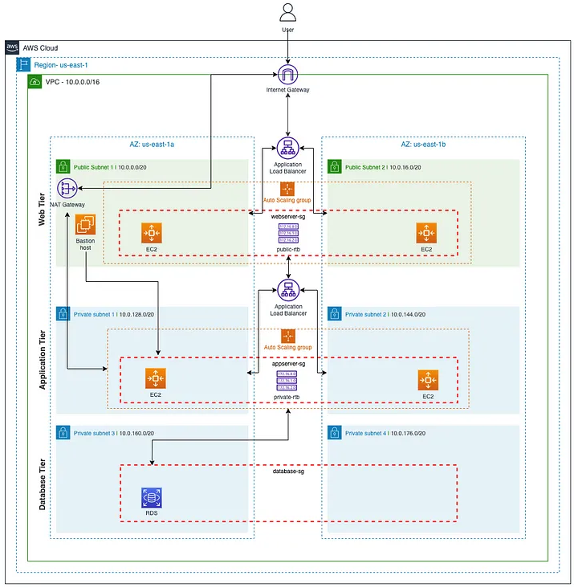
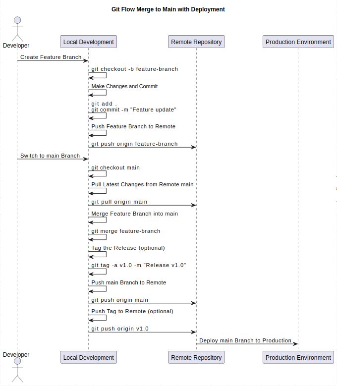

# DevOps Technical Assestment

- Provide terraform for a 3-tier network with Postgres rds, fault tolerance, and load balancing:[terraform-3-tier](https://github.com/JayKearney/technical-assestment/tree/main/terraform-3-tier/terraform)

- Provide a network diagram for the 3-tier network: 

- Provide a helm chart for a Java application, and please specify scaling and resources: [halm-java-app](https://github.com/JayKearney/technical-assestment/tree/main/helm-java-app)

- - Provide a diagram of a standard git-flow merge to main with deployment. Please use git CLI commands to demonstrate the process: 

